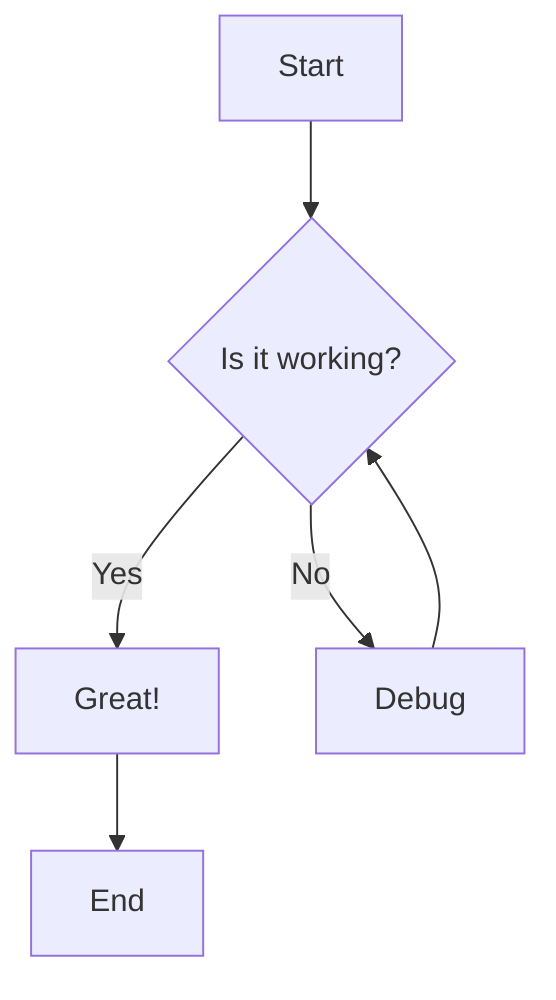
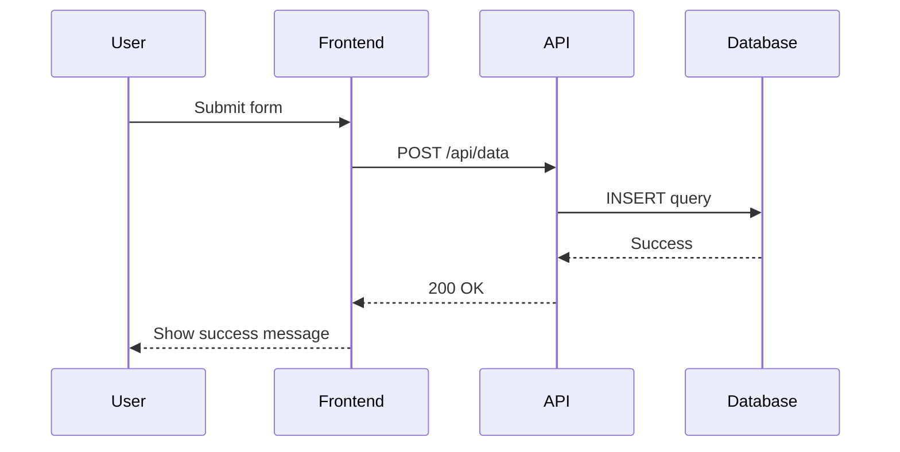
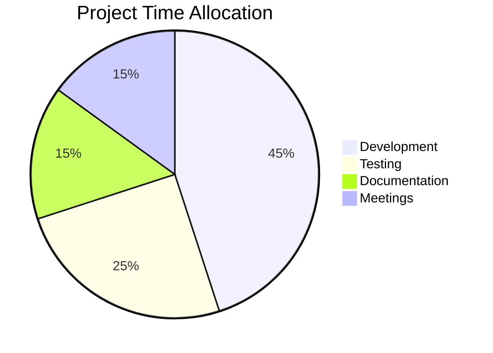

# Svelte Streamdown


A **Svelte port** of [Streamdown](https://streamdown.ai/) by Vercel - an all in one markdown renderer, designed specifically for AI-powered streaming applications.

## 📦 Installation

```bash
npm install svelte-streamdown
# or
pnpm add svelte-streamdown
# or
yarn add svelte-streamdown
```

## 🚀 Overview

Perfect for AI-powered applications that need to stream and render markdown content safely and beautifully, with support for incomplete markdown blocks, security hardening, and rich features like code highlighting, math expressions, and interactive diagrams.

## ✨ Main Features

### 🔄 Streaming-Optimized

- **Incomplete Markdown Parsing**: Handles unterminated blocks gracefully
- **Progressive Rendering**: Perfect for streaming AI responses
- **Real-time Updates**: Optimized for dynamic content
- **Smooth Animations**: Animate tokens and blocks as they are streamed.

### 🔒 Security Hardening

- **Image Origin Control**: Whitelist allowed image sources
- **Link Safety**: Control link destinations

### 🎯 Fully Customizable Components & Theming

- **Every component customizable** with Svelte snippets
- **Granular theming system** - customize every part of every component
- Override default styling and behavior for any markdown element
- Full control over rendering with type-safe props
- Seamless integration with your design system

### 🎨 Built-in Typography Styles

Beautiful, responsive typography with **built-in Tailwind CSS classes** for headings, lists, code blocks, and more. Comes with a complete default theme that works out of the box.

### 📝 Extensive Markdown Features

Full support for

- Basic text marks: **bold**, _italic_, `code`, ~~Strikethrough~~
- ~Subscript~ and ^Superscript^
- [Links](https://svelte-streamdown.beynar.workers.dev/)
- Headings (H1–H6)
- Blockquotes
- Github alert
- Ordered & unordered lists (including roman, alpha, nested)
- Task lists ([ ] and [x])
- Code blocks
- Mermaid diagrams
- Math $expressions$
- Escaping currency symbols ($140)
- Complex tables
- Footnotes [^1]
- Inline citations [ref] [ref2]
- MDX components (embed custom Svelte components)

[^1]:
    Reference render in a popover by default.
    with _rich_ **content** support
    and multiline

> [!NOTE]
> 🧠 **AI Prompting Tip:** For best results, use our [comprehensive prompt](/prompting) covering all supported markdown features.

### 💻 Interactive Code Blocks

- Syntax highlighting powered by Shiki
- Copy-to-clipboard functionality
- Support any Shiki themes

### 🔢 Mathematical Expressions

LaTeX math support through KaTeX. Use single dollars for **inline** math and double dollars for **block** (display) math:

- Inline math: `$E = mc^2$` renders inline as $E = mc^2$
- Block math:

$$
f(x) = \frac{1}{\sigma\sqrt{2\pi}} e^{-\frac{1}{2}\left(\frac{x-\mu}{\sigma}\right)^2}
$$

KaTeX is an **opt-in** heavy component, so you must import the `Math` component and pass it via the `components` prop. Without it, math is rendered as raw text:

```svelte
<script>
	import { Streamdown } from 'svelte-streamdown';
	import Math from 'svelte-streamdown/math'; // KaTeX math rendering
</script>

<Streamdown {content} components={{ math: Math }} />
```

Pass KaTeX options through the [`katexConfig`](#-props-api) prop (e.g. to set `throwOnError` or macros). See [Bundle Optimization](#-bundle-optimization) for details on enabling heavy components.

### 🧜‍♀️ Mermaid Diagrams

- Render Mermaid diagrams from code blocks
- **Incremental rendering** during streaming content
- Pan and Zoom
- Full screen mode

# **Example:**







### Complex table support

#### Colspan

| H1                        | H2  | H3  |
| ------------------------- | --- | --- |
| This cell spans 3 columns |     |     |

| Header 1                  | Header 2 | Header 3 |
| ------------------------- | -------- | -------- |
| This cell spans 2 columns |          | Normal   |
| Normal                    | Normal   | Normal   |

#### Rowspan

| Header 1        | Header 2 |
| --------------- | -------- |
| This cell spans | Cell A   |
| two rows ^      | Cell B   |

#### Footer

| Header 1        | Header 2 |
| --------------- | -------- |
| Cell B          | Cell A   |
| --------------- | -------- |
| Footer          |          |

#### Column alignment

| Left | Center | Right |
| :--- | :----: | ----: |
| A    |   B    |     C |

#### Multiple headers and very complex layout

| Product Category ||| Sales Data Q1-Q4 2024 ||||
| Product | Region || Q1 | Q2 | Q3 | Q4 |
| Name | Type | Area | Revenue | Revenue | Revenue | Revenue |
|-------------|---------|------------|---------|---------|---------|---------|
| Laptop Pro | Electronics | North America || $45,000 | $52,000 | $48,000 |
| Laptop Pro ^ | ^ | Europe | $32,000 | $38,000 | $41,000 | $44,000 |
| Laptop Pro ^ | ^ | Asia || $28,000 | $35,000 | $42,000 |
| Office Chair | Furniture | North America | $15,000 | $18,000 | $16,000 | $17,000 |
| Office Chair ^ | ^ | Europe | $12,000 | $14,000 | $15,000 | $16,000 |
| Wireless Mouse | Electronics | Global ||| $25,000 | $28,000 |
|-------------|---------|------------|---------|---------|---------|---------|
| **Total Revenue** ||| **$152,000** | **$185,000** | **$187,000** | **$205,000** |

### Complex list support

#### decimal

1. First item
2. Second item
3. Third item

#### lower-alpha

a. First item  
b. Second item  
c. Third item

#### upper-alpha

A. First item  
B. Second item  
C. Third item

#### lower-roman

i. First item  
ii. Second item  
iii. Third item

#### upper-roman

I. First item  
II. Second item  
III. Third item

#### Nested Lists

1. First level (numeric)
   a. Second level (lowercase alpha)
   i. Third level (lowercase roman) - Fourth level (bullet)
   I. Fifth level (uppercase roman)
   A. Sixth level (uppercase alpha)

2. Back to the first level

#### Task List

- [ ] Uncompleted task
- [x] Completed task
- [ ] Another uncompleted task
  - [ ] Nested uncompleted subtask
  - [x] Nested completed subtask

### Alert Support

> [!IMPORTANT]
> Native support for Github style Alert

### Description List

    :   Topic 1   :  Description 1
    : **Topic 2** : *Description 2*
    :   Topic 3   :  Description 3
    :   Topic 3   :  Description 3

### Citation Support

Streamdown supports inline citations that allow you to reference external sources and display them in interactive popovers. Citations work with both object keys and numeric (array-style) keys like [1] and [123], as well as text keys like [source1] and [anything]. Nested references also work: `[cloudflare.website, vercel]` renders as [cloudflare.website, vercel]

To enable inline citations, pass a `sources` object as a prop to the `Streamdown` component.

#### Basic Usage

```svelte
<script>
	import { Streamdown } from 'svelte-streamdown';

	let content = `According to [smith2023], AI is advancing rapidly. See also [nested.subsection] for related work.`;

	let sources = {
		smith2023: {
			title: 'AI Research Paper',
			url: 'https://example.com/paper',
			content: 'Detailed content of the citation...'
		},
		nested: {
			subsection: {
				title: 'Nested Citation',
				url: 'https://example.com/nested'
			}
		}
	};
</script>

<Streamdown {content} {sources} />
```

#### Default Citation Structure

Citations work with objects containing these properties:

- `title (or name or author)`: Display title for the citation
- `url (or href, url, link or source)`: Link to the source
- `content (or text, summary or excerpt)`: Rich content to display in carousel mode

#### Display Modes

Streamdown offers two ways to display citations:

- **List View**: Shows all citations in a compact list format
- **Carousel View** (default): Step-through navigation for multiple citations with full content display

You can control the display mode using the `inlineCitationsMode` prop:

```svelte
<!-- List view -->
<Streamdown {content} {sources} inlineCitationsMode="list" />

<!-- Carousel view (default) -->
<Streamdown {content} {sources} inlineCitationsMode="carousel" />
```

#### Citation Popovers

Citations appear as clickable buttons that open popovers when clicked. The popover shows:

- Source title and URL (when available)
- Favicon from the source domain
- Rich content (in carousel mode)
- Navigation controls (in carousel mode for multiple citations)

#### Custom Citation Rendering

If your citation data structure doesn't match the default format, you can customize how citations are rendered using `inlineCitationPreview`, `inlineCitationContent` or `inlineCitationPopover` snippets:

```svelte
<Streamdown {content} {sources}>
	{#snippet inlineCitationPreview({ token })}
		<!-- Customize the clickable citation button -->
		{token.keys[0]}
	{/snippet}

	{#snippet inlineCitationContent({ source, key, token })}
		<!-- Customize content displayed in popover -->
		<div class="custom-content">
			<h4>{source.customTitle || key}</h4>
			<p>{source.customDescription}</p>
		</div>
	{/snippet}
</Streamdown>
```

These snippets allow you to:

- **`inlineCitationPreview`**: Customize the content of the clickable button that appears in the text
- **`inlineCitationContent`**: Customize how individual citation content is displayed within popovers
- **`inlineCitationPopover`**: Completely customize the list of citations

## 🔄 Differences from Original React Version

This Svelte port maintains feature parity with the original [Streamdown](https://streamdown.ai/) while adapting to Svelte's patterns:

| Aspect            | Original (React)         | Svelte Port                              |
| ----------------- | ------------------------ | ---------------------------------------- |
| **Framework**     | React                    | Svelte 5                                 |
| **Component API** | JSX Components           | Svelte Snippets                          |
| **Styling**       | Tailwind CSS             | Tailwind CSS (compatible)                |
| **Context**       | React Context            | Svelte Context                           |
| **Build System**  | Vite/React               | Vite/SvelteKit                           |
| **TypeScript**    | Full TS support          | Full TS support                          |
| **Engine**        | Remark / Rehype + marked | marked only                              |
| **Memoization**   | Memoized `Block` (LRU)   | Svelte reactivity (per-block `$derived`) |

### Tailwind CSS Setup

> [!NOTE]
> Streamdown comes with **built-in Tailwind CSS classes** for beautiful default styling. To ensure all styles are included in your build, add the following to your `app.css` or main CSS file:
> This setup is primarily necessary if you're using Tailwind CSS v4's new `@source` directive or if you have aggressive purging enabled in older versions. If you're using standard Tailwind CSS v3+ with default purging, Streamdown's styles should be automatically included when the component is imported and used in your application.
>
> This ensures that all Streamdown's default styling is included in your Tailwind build process.

```css
@import 'tailwindcss';
/* Add Streamdown styles to your Tailwind build */
@source "../node_modules/svelte-streamdown/**/*";
```

> [!IMPORTANT]
> The `@source` path is **relative to the stylesheet file** that contains the directive, so adjust the number of `../` segments to match where your stylesheet lives. The example above assumes `src/app.css`. If your global stylesheet lives one level deeper (e.g. `src/routes/+layout.css`, the default in newer SvelteKit projects), add one more `../` so the glob still resolves to your project's `node_modules`:

```css
@import 'tailwindcss';
/* Add Streamdown styles to your Tailwind build (stylesheet inside src/routes) */
@source "../../node_modules/svelte-streamdown/**/*";
```

## ⚡ Streaming Performance & Memoization

Like the original [Streamdown](https://streamdown.ai/), `svelte-streamdown` avoids re-parsing the whole document on every streaming update — but it achieves this through Svelte 5's fine-grained reactivity rather than an explicit parse cache.

Here is how it works on each content update:

1. **Block splitting**: the incoming `content` is split into top-level markdown blocks with `parseBlocks`. This is a lightweight lexer pass that only computes each block's raw string.
2. **Keyed rendering**: blocks are rendered with a keyed `{#each}`, so existing block components are preserved across updates instead of being torn down and recreated.
3. **Per-block memoized lexing**: each block component derives its tokens from its own raw string (`const tokens = $derived(lex(...))`). A Svelte `$derived` only recomputes when its inputs change, so a block is only re-lexed (the expensive inline tokenization step) when **its own** raw string changes.

During streaming, newly received text almost always only changes the **last** block (and occasionally starts a new one). Every earlier block keeps an identical raw string, so Svelte skips its `lex()` call entirely — this is the equivalent of the memoized `Block` component in the React version. The block-splitting pass itself runs on every update, but it is the cheap pass; the costly inline parsing is what gets reused.

Code highlighting is incremental as well: a code block is only re-highlighted when its text changes, and the Shiki highlighter caches the languages and themes it has already loaded, so a streaming code block does not reload its grammar on every chunk.

> [!NOTE]
> There is intentionally no separate block-level parse cache (e.g. an LRU keyed by block content). For the common append-only streaming case the reactivity-based approach above already avoids redundant work, and a standalone cache would add memory usage and invalidation complexity without a measurable benefit. If you have a workload where this matters, please [open an issue](https://github.com/beynar/svelte-streamdown/issues) with a repro — we're happy to revisit.

## 🎭 Animation System

Streamdown includes an animation system designed specifically for streaming AI content, providing smooth and engaging visual feedback as text appears on screen.

### How It Works

The animation system works by:

1. **Tokenization**: Text is broken down into tokens (words or characters) based on your configuration
2. **Sequential Animation**: Each token animates as it is received
3. **Block-level Animation**: Entire blocks (paragraphs, headings, code blocks) animate as units

### Animation Types

Choose from 4 distinct animation styles:

#### `fade`

A clean fade-in effect where text smoothly appears from transparent to opaque.

#### `blur`

Text starts slightly blurred and comes into focus while fading in, creating a smooth reveal effect.

#### `slideUp`

Text slides up from below while fading in, creating a dynamic upward motion.

#### `slideDown`

Text slides down from above while fading in, creating a dynamic downward motion.

> [!TIP]
> For production applications where the LLM is not streaming (static content), disable animations entirely by setting `animation.enabled = false` to minimize DOM elements and improve performance.
>
> If using AI SDK mind to smooth stream the content to using word-level tokenization to avoid partial words not being animated.

> [!WARNING]
> Character-level tokenization (`tokenize: 'char'`) creates significantly more DOM elements than word-level tokenization. Use character tokenization sparingly and only when the typewriter effect is essential for your user experience.

## 🚀 Quick Start

### Basic Usage

```svelte
<script>
	import { Streamdown } from 'svelte-streamdown';

	let content = `# Hello World

This is a **bold** text and this is *italic*.

\`\`\`javascript
console.log('Hello from Streamdown!');
\`\`\`
`;
</script>

<Streamdown {content} />
```

### Advanced Usage with Custom Components

```svelte
<script>
	import { Streamdown } from 'svelte-streamdown';

	let content = `# Custom Components Example

This heading will use a custom component!`;
</script>

<Streamdown {content}>
	{#snippet heading({ children })}
		<h1 class="mb-4 text-4xl font-bold text-blue-600">
			{@render children()}
		</h1>
	{/snippet}
</Streamdown>
```

### Security Configuration

```svelte
<script>
	import { Streamdown } from 'svelte-streamdown';

	let markdown = `
[Safe Link](https://trusted-domain.com/page)`;
</script>

<Streamdown
	{content}
	allowedImagePrefixes={['https://trusted-domain.com']}
	allowedLinkPrefixes={['https://trusted-domain.com']}
/>
```

Prefixes can also be **protocol-only**, which allows any URL using that protocol. For example, `'https://'` allows every HTTPS link while still blocking insecure `http://` links, and `'mailto:'` / `'tel:'` allow email and phone links:

```svelte
<Streamdown
	{content}
	allowedLinkPrefixes={['https://', 'mailto:']}
	allowedImagePrefixes={['https://']}
/>
```

> [!NOTE]
> `'*'` allows all `http://` and `https://` URLs. A protocol-only prefix only allows that exact protocol, so list each one you want to permit. Only add a protocol you trust — e.g. do not add `'javascript:'`.

## 📦 Bundle Optimization

Streamdown is optimized for minimal bundle size by making heavy components **opt-in**. By default, Code blocks, Mermaid diagrams, and Math expressions render as lightweight fallbacks (plain text). To enable full functionality, import and pass the components you need:

### Enabling Heavy Components

```svelte
<script>
	import { Streamdown } from 'svelte-streamdown';
	// Import only the components you need
	import Code from 'svelte-streamdown/code'; // Shiki syntax highlighting
	import Mermaid from 'svelte-streamdown/mermaid'; // Mermaid diagrams
	import Math from 'svelte-streamdown/math'; // KaTeX math rendering
</script>

<Streamdown {content} components={{ code: Code, mermaid: Mermaid, math: Math }} />
```

### Component Dependencies

| Component | Import Path                 | Dependency | Size Impact               |
| --------- | --------------------------- | ---------- | ------------------------- |
| `Code`    | `svelte-streamdown/code`    | Shiki      | ~2MB (languages + themes) |
| `Mermaid` | `svelte-streamdown/mermaid` | Mermaid.js | ~1.5MB                    |
| `Math`    | `svelte-streamdown/math`    | KaTeX      | ~300KB                    |

> [!TIP]
> Only import the components your application actually uses. If your content doesn't include code blocks, mermaid diagrams, or math expressions, you can skip those imports entirely for a much smaller bundle.

### Fallback Behavior

When a heavy component is not provided:

- **Code blocks**: Render as plain `<pre><code>` without syntax highlighting
- **Mermaid**: Renders the mermaid source as a code block
- **Math**: Renders the raw LaTeX/math text

### Shiki Themes

The `Code` component bundles two themes out of the box: **`github-dark`** and **`github-light`**. By default `shikiTheme` follows the active color scheme (`github-dark` in dark mode, `github-light` otherwise), so basic light/dark theming works with no extra configuration.

To use any other Shiki theme (e.g. `vesper`, `github-dark-default`, `github-light-default`), import it from `@shikijs/themes/<name>` and register it via the `shikiThemes` prop. The **key** you register it under is the value you pass to `shikiTheme`:

```svelte
<script lang="ts">
	import { Streamdown } from 'svelte-streamdown';
	import Code from 'svelte-streamdown/code'; // enables Shiki highlighting
	import vesper from '@shikijs/themes/vesper';

	let { content } = $props();
</script>

<Streamdown {content} components={{ code: Code }} shikiThemes={{ vesper }} shikiTheme="vesper" />
```

> [!IMPORTANT]
> A theme passed to `shikiTheme` must be one of the two built-in themes **or** registered via `shikiThemes`. If it is neither, the code block stays in its loading (skeleton) state and is never highlighted — this is the most common cause of "my theme stopped working".

#### Dynamic (light/dark) theme switching

Register every theme you intend to switch between in `shikiThemes`, then drive `shikiTheme` from your color-scheme store. Switching is fully reactive — code blocks re-highlight when `shikiTheme` changes:

```svelte
<script lang="ts">
	import { Streamdown } from 'svelte-streamdown';
	import Code from 'svelte-streamdown/code';
	import { mode } from 'mode-watcher';
	import githubDarkDefault from '@shikijs/themes/github-dark-default';
	import githubLightDefault from '@shikijs/themes/github-light-default';

	let { content } = $props();

	const shikiTheme = $derived(
		mode.current === 'dark' ? 'github-dark-default' : 'github-light-default'
	);
</script>

<Streamdown
	{content}
	components={{ code: Code }}
	baseTheme="shadcn"
	shikiThemes={{
		'github-dark-default': githubDarkDefault,
		'github-light-default': githubLightDefault
	}}
	{shikiTheme}
/>
```

> [!NOTE]
> The built-in `github-dark` / `github-light` themes can be switched dynamically with just `shikiTheme` (no `shikiThemes` registration needed), since both are always loaded.

#### Migrating from v2 (`shikiPreloadThemes`)

The v2 `shikiPreloadThemes` prop has been **removed**. Themes are no longer referenced by bundled name; instead you import the theme objects yourself and register them with `shikiThemes`. Registered themes are loaded together with the highlighter (i.e. effectively preloaded), so there is no separate preload step:

```diff
- shikiPreloadThemes={['github-dark-default', 'github-light-default']}
+ shikiThemes={{ 'github-dark-default': githubDarkDefault, 'github-light-default': githubLightDefault }}
```

This also keeps the default bundle small: only the themes you actually import are included.

## 📋 Props API

| Prop                       | Type                                                                                                        | Default                | Description                                                                                                                                                                                                                  |
| -------------------------- | ----------------------------------------------------------------------------------------------------------- | ---------------------- | ---------------------------------------------------------------------------------------------------------------------------------------------------------------------------------------------------------------------------- |
| `content`                  | `string`                                                                                                    | -                      | **Required.** The markdown content to render                                                                                                                                                                                 |
| `sources`                  | `Record<string, any>`                                                                                       | -                      | Citation data object for inline citations                                                                                                                                                                                    |
| `class`                    | `string`                                                                                                    | -                      | CSS class names for the wrapper element                                                                                                                                                                                      |
| `parseIncompleteMarkdown`  | `boolean`                                                                                                   | `true`                 | Parse and fix incomplete markdown syntax                                                                                                                                                                                     |
| `defaultOrigin`            | `string`                                                                                                    | -                      | Default origin for relative URLs                                                                                                                                                                                             |
| `allowedLinkPrefixes`      | `string[]`                                                                                                  | `['*']`                | Allowed URL prefixes for links                                                                                                                                                                                               |
| `allowedImagePrefixes`     | `string[]`                                                                                                  | `['*']`                | Allowed URL prefixes for images                                                                                                                                                                                              |
| `skipHtml`                 | `boolean`                                                                                                   | -                      | Skip HTML parsing entirely                                                                                                                                                                                                   |
| `unwrapDisallowed`         | `boolean`                                                                                                   | -                      | Unwrap instead of removing disallowed elements                                                                                                                                                                               |
| `urlTransform`             | `UrlTransform \| null`                                                                                      | -                      | Custom URL transformation function                                                                                                                                                                                           |
| `theme`                    | `DeepPartial<Theme>`                                                                                        | -                      | Custom theme overrides                                                                                                                                                                                                       |
| `baseTheme`                | `'tailwind' \| 'shadcn'`                                                                                    | `'tailwind'`           | Base theme to use before applying overrides                                                                                                                                                                                  |
| `mergeTheme`               | `boolean`                                                                                                   | `true`                 | Whether to merge theme with base theme                                                                                                                                                                                       |
| `shikiTheme`               | `string`                                                                                                    | auto (dark-mode aware) | Code highlighting theme. Defaults to `github-dark` in dark mode / `github-light` otherwise. Any other value must be a key registered via `shikiThemes`. See [Shiki Themes](#shiki-themes).                                   |
| `shikiThemes`              | `Record<string, ThemeRegistration>`                                                                         | -                      | Register additional pre-imported themes (e.g. `{ vesper }`) so they can be selected via `shikiTheme`, including dynamic light/dark switching. Replaces the v2 `shikiPreloadThemes` prop.                                     |
| `shikiLanguages`           | `LanguageInfo[]`                                                                                            | -                      | Additional syntax highlighting languages (merged with defaults)                                                                                                                                                              |
| `mermaidConfig`            | `MermaidConfig`                                                                                             | -                      | Mermaid diagram configuration                                                                                                                                                                                                |
| `katexConfig`              | `KatexOptions \| ((inline: boolean) => KatexOptions)`                                                       | -                      | KaTeX math rendering options                                                                                                                                                                                                 |
| `animation`                | `AnimationConfig`                                                                                           | -                      | Animation configuration for streaming content                                                                                                                                                                                |
| `animation.enabled`        | `boolean`                                                                                                   | `false`                | Enable/disable animations                                                                                                                                                                                                    |
| `animation.type`           | `'fade' \| 'blur' \| 'typewriter' \| 'slideUp' \| 'slideDown'`                                              | `'blur'`               | Animation style for text appearance                                                                                                                                                                                          |
| `animation.duration`       | `number`                                                                                                    | `500`                  | Animation duration in milliseconds                                                                                                                                                                                           |
| `animation.timingFunction` | `'ease' \| 'ease-in' \| 'ease-out' \| 'ease-in-out' \| 'linear'`                                            | `'ease-in'`            | CSS timing function for animations                                                                                                                                                                                           |
| `animation.tokenize`       | `'word' \| 'char'`                                                                                          | `'word'`               | Tokenization method for text animations                                                                                                                                                                                      |
| `animation.animateOnMount` | `boolean`                                                                                                   | `false`                | Run the token animation on mount or not, useful if you render the Streamdown component in the same time as the first token is receive from the LLM                                                                           |
| `extensions`               | `Array<Extension>`                                                                                          | `[]`                   | Custom marked tokenizers to render special markdown blocks or inline tokens                                                                                                                                                  |
| `mdxComponents`            | `Record<string, Component>`                                                                                 | `{}`                   | Map of MDX component names to Svelte components (e.g., `{ Card, Button }`)                                                                                                                                                   |
| `components`               | `{ code?, mermaid?, math? }`                                                                                | -                      | Optional heavy components for syntax highlighting, diagrams, and math rendering                                                                                                                                              |
| `controls`                 | `{ code?: boolean, mermaid?: boolean \| { enabled?: boolean, mouseWheelZoom?: boolean }, table?: boolean }` | all `true`             | Toggle the action toolbars for code blocks, mermaid diagrams, and tables. For mermaid, pass an object to disable only mouse-wheel zoom while keeping pan and the zoom buttons, e.g. `{ mermaid: { mouseWheelZoom: false } }` |
| `children`                 | `Snippet<[{token:GenericToken, streamdown: StreamdownContext, children: Snippet`                            | `undefined`            | Snippet used to render elements not supported by Streamdown, custom extensions, and MDX components                                                                                                                           |

#### All Available Customizable Elements:

**Text Elements**: `heading`, `p`, `strong`, `em`, `del`

**Links & Media**: `a`, `img`

**Lists**: `ul`, `ol`, `li`

**Code**: `code`, `codeSpan`

**Tables**: `table`, `thead`, `tbody`, `tr`, `th`, `td`, `tfoot`

**Special Content**: `blockquote`, `hr`, `alert`, `mermaid`, `math`, `footnoteRef`, `inlineCitation`

**MDX Components**: Handled via a single `mdx` snippet that receives `token`, `props`, and `children`. Use `token.tagName` to differentiate between components.

**Note**: The above elements are **supported by Streamdown** and should be customized using individual props or the theme system. MDX components require the `mdx` snippet.

## 🎨 Theming System

### Built-in Themes

Streamdown comes with two built-in themes:

- **Default Theme**: The standard theme with gray-based colors
- **Shadcn Theme**: A theme that uses shadcn/ui design tokens for seamless integration with shadcn-based projects

Beyond custom snippets, Streamdown provides a **granular theming system** that lets you customize every part of every component without writing custom snippets. You can use the built-in themes (default and shadcn) or create completely custom themes using the `mergeTheme` utility.

### Theme Structure

Every component has multiple themeable parts. For example, the `code` component has:

```typescript
code: {
  base: 'bg-gray-100 rounded p-2 font-mono text-sm',           // Main code block
  container: 'my-4 w-full overflow-hidden rounded-xl border',   // Wrapper container
  header: 'flex items-center justify-between bg-gray-100/80',  // Header with language
  button: 'cursor-pointer p-1 text-gray-600 transition-all',   // Copy button
  language: 'ml-1 font-mono lowercase',                        // Language label
  pre: 'overflow-x-auto font-mono p-0 bg-gray-100/40'        // Pre element
}
```

### Using Custom Themes

```svelte
<script>
	import { Streamdown } from 'svelte-streamdown';

	let content = `# Custom Theme Example

\`\`\`javascript
console.log('Beautiful code blocks!');
\`\`\`

> This blockquote is also themed

| Header 1 | Header 2 |
|----------|----------|
| Cell 1   | Cell 2   |
`;

	// Custom theme overrides
	let customTheme = {
		code: {
			container: 'my-6 rounded-2xl border-2 border-purple-200 shadow-lg',
			header: 'bg-purple-50 text-purple-700 font-medium',
			button: 'text-purple-600 hover:text-purple-800 hover:bg-purple-100'
		},
		blockquote: {
			base: 'border-l-8 border-purple-400 bg-purple-50 p-4 italic text-purple-800'
		},
		table: {
			base: 'border-purple-200 shadow-md',
			container: 'my-6 rounded-lg overflow-hidden'
		},
		th: {
			base: 'bg-purple-100 px-6 py-3 text-purple-900 font-bold'
		},
		td: {
			base: 'px-6 py-3 border-purple-100'
		}
	};
</script>

<Streamdown {content} theme={customTheme} />
```

### All Themeable Components

Each component supports multiple themeable parts:

**Headings (`h1`-`h6`)**: `base`

**Text Elements (`p`, `strong`, `em`, `del`)**: `base`

**Lists (`ul`, `ol`, `li`)**: `base`

**Links (`a`)**: `base`, `blocked` (for blocked/unsafe links)

**Code (`code`)**: `base`, `container`, `header`, `button`, `language`, `skeleton`, `pre`

**Inline Code (`inlineCode`)**: `base`

**Images (`img`)**: `container`, `base`, `downloadButton`

**Tables (`table`, `thead`, `tbody`, `tr`, `th`, `td`)**: `base`, `container` (table only)

**Blockquotes (`blockquote`)**: `base`

**Alerts (`alert`)**: `base`, `title`, `icon`, plus type-specific styles (`note`, `tip`, `warning`, `caution`, `important`)

**Mermaid (`mermaid`)**: `base`, `downloadButton`

**Math (`math`, `inlineMath`)**: `base`

**Other (`hr`, `sup`, `sub`)**: `base`

### Theme Merging

Themes are intelligently merged using Tailwind's class merging utility, so you only need to override the specific parts you want to customize while keeping the default styling for everything else.

## 🧩 MDX Component Support

Streamdown supports MDX-style JSX components, allowing you to embed custom Svelte components directly in your markdown content.

### Basic Usage

```svelte
<script>
	import { Streamdown } from 'svelte-streamdown';

	let content = `
# Using MDX Components

<Card title="Hello" count={42}>
This is **markdown content** inside a component!
</Card>

<Button label="Click me" active={true} />
`;
</script>

<Streamdown {content}>
	{#snippet mdx({ token, props, children })}
		{#if token.tagName === 'Card'}
			<div class="rounded-lg border border-gray-200 p-4 shadow-sm">
				<h3 class="text-xl font-bold">{props.title}</h3>
				<p class="text-gray-600">Count: {props.count}</p>
				<div class="mt-2">
					{@render children()}
				</div>
			</div>
		{:else if token.tagName === 'Button'}
			<button class="rounded px-4 py-2 {props.active ? 'bg-blue-500 text-white' : 'bg-gray-200'}">
				{props.label}
			</button>
		{:else}
			{@render children()}
		{/if}
	{/snippet}
</Streamdown>
```

### Alternative: Using Svelte Components Directly

Instead of using the `mdx` snippet with conditional logic, you can pass Svelte components directly using the `mdxComponents` prop:

```svelte
<script>
	import { Streamdown } from 'svelte-streamdown';
	import Card from './Card.svelte';
	import Button from './Button.svelte';

	let content = `
# Using MDX Components

<Card title="Hello" count={42}>
This is **markdown content** inside a component!
</Card>

<Button label="Click me" active={true} />
`;
</script>

<Streamdown {content} mdxComponents={{ Card, Button }} />
```

**Your Svelte components** (`Card.svelte`, `Button.svelte`) should accept props and a `children` snippet:

```svelte
<!-- Card.svelte -->
<script>
	let { title, count, children } = $props();
</script>

<div class="rounded-lg border border-gray-200 p-4 shadow-sm">
	<h3 class="text-xl font-bold">{title}</h3>
	<p class="text-gray-600">Count: {count}</p>
	<div class="mt-2">
		{@render children()}
	</div>
</div>
```

```svelte
<!-- Button.svelte -->
<script>
	let { label, active } = $props();
</script>

<button class="rounded px-4 py-2 {active ? 'bg-blue-500 text-white' : 'bg-gray-200'}">
	{label}
</button>
```

This approach is cleaner when you have standalone component files, while the `mdx` snippet approach is better for inline component definitions or when you need shared logic across components.

### Supported Syntax

**Self-closing components:**

```markdown
<Component attr="value" count={42} enabled={true} />
```

**Components with markdown children:**

```markdown
<Component title="Hello">
# This is a heading
This **markdown** content will be parsed!
</Component>
```

### Attribute Types

MDX components support three attribute value types:

- **Strings**: `attr="hello"` → `"hello"`
- **Numbers**: `count={42}` or `value={3.14}` → `42`, `3.14`
- **Booleans**: `active={true}` or `disabled={false}` → `true`, `false`
- **Expressions**: `value={variableName}` → `"variableName"` (stored as string)

### Component Naming

- Component names **must start with a capital letter** (PascalCase)
- Valid: `<Card />`, `<MyComponent />`, `<Component123 />`
- Invalid: `<card />`, `<myComponent />` (these are treated as HTML)

### Streaming Safety

MDX components are streaming-safe. Incomplete components are automatically handled during AI streaming:

- Incomplete tags like `<Component attr` not rendered to prevent runtime errors
- Unclosed components like `<Card>content` are auto-closed with `</Card>`
- Malformed attributes are escaped to prevent rendering errors

This ensures your UI remains stable even when receiving partial markdown from streaming AI responses.

### Component Props

The `mdx` snippet receives three parameters:

- `token`: The full MdxToken with `tagName`, `attributes`, `selfClosing`, etc.
- `props`: Object containing all parsed attributes (e.g., `props.title`, `props.count`)
- `children`: Snippet containing parsed markdown content

Use `token.tagName` to determine which component is being rendered:
<Card title="Hello" count={5}>Content</Card>

```svelte
<!-- Markdown: <Card title="Hello" count={5}>Content</Card> -->
<Streamdown {content}>
	{#snippet mdx({ token, props, children })}
		{#if token.tagName === 'Card'}
			<div>
				<h3>{props.title}</h3>
				<span>Count: {props.count}</span>
				{@render children()}
			</div>
		{:else if token.tagName === 'Alert'}
			<div class="alert alert-{props.type}">
				{@render children()}
			</div>
		{:else}
			<!-- Fallback for unknown components -->
			{@render children()}
		{/if}
	{/snippet}
</Streamdown>
```

## 💉 Extensibility

Streamdown is extensible through the use of custom extensions.

An extension is an object that has a `name`, a `level` and a `tokenizer` function.

- `name`: The name of the extension
- `level`: The level of the extension, can be `block` or `inline`
- `tokenizer`: The tokenizer function, see [marked](https://github.com/markedjs/marked) for more information

To render the extension custom tokens, you can then simply use the `children` snippet.

### Example

```svelte
<script lang="ts">
	import { Streamdown, type Extension } from 'svelte-streamdown';
	const markedCollapsible: Extension = {
		name: 'collapsible',
		level: 'block',
		tokenizer(this, src) {
			// Match [detail]...[detail] blocks (case insensitive)
			const detailMatch = src.match(/^\[detail\](.*?)\[detail\]/is);

			if (detailMatch) {
				const content = detailMatch[1] || '';
				const tokens = this.lexer.blockTokens(content);

				return {
					type: 'detail',
					raw: detailMatch[0], // The entire matched string including tags
					tokens
				};
			}

			return undefined;
		}
	};
</script>

<Streamdown
	extensions={[markedCollapsible]}
	content={`
[detail]	
This is a collapsible **section**
[detail]`}
>
	{#snippet children({ token, streamdown, children })}
		{#if token.type === 'detail'}
			<details>
				<summary> Detail </summary>
				<div>
					{@render children()}
				</div>
			</details>
		{/if}
	{/snippet}
</Streamdown>
```

## 🛠️ Development

### Setup

```bash
# Clone the repository
git clone <repository-url>
cd svelte-streamdown

# Install dependencies
pnpm install

# Start development server
pnpm dev

# Run tests
pnpm test

# Build for production
pnpm build
```

### Building

```bash
# Build the library
pnpm build

# Preview the showcase app
pnpm preview
```

## 🤝 Contributing

Contributions are welcome! This is a port of the original Streamdown project, so please:

1. Check the [original Streamdown repository](https://github.com/vercel/streamdown) for upstream changes
2. Ensure compatibility with the original API
3. Maintain feature parity where possible
4. Add tests for new features if you want

## 📄 License

MIT

## 🙏 Acknowledgments

- **Original Streamdown**: [Vercel](https://vercel.com) for creating the original React component
- **Svelte Community**: For the amazing framework that made this port possible
- **All Contributors**: For helping improve and maintain this project

---

Made with ❤️ and 🤖
